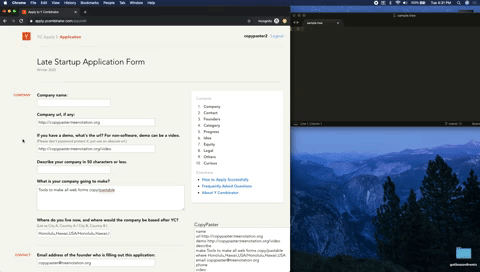
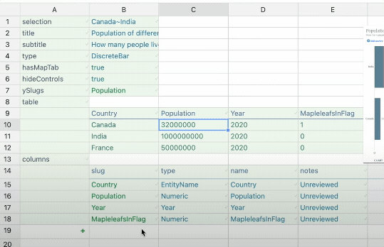

# CopyPaster

In 2021 let's start making all web forms copy/pasteable.
This will allow for much faster form filling, eReceipts,
collaborative editing of forms with version control via Git,
and a whole lot more.

## Demo

[Watch the Demo on YouTube](https://www.youtube.com/watch?v=rDJmzaSTe_c)

## Why now?

[TreeNotation](https://treenotation.org/) makes it possible
to do all of this in a simple, robust, typesafe way. Filling
out a web form is isomorphic to editing a Tree Notation
document. As a user edits a form, a textarea updates with
the Tree Notation version. The user can copy/paste to and
from that textarea.

## But wait, there's more!

Editing a Tree Notation document is **also isomorphic to
editing a spreadsheet**. So all web forms can be a web
form AND a single copy/pasteable Tree Notation document AND
a spreadsheet!

## Future Work

If you like this idea, [star this repo]
(https://github.com/treenotation/copypaster). You can
implement this idea yourself on your own site!

Need help? Just reach out here or in the Tree Notation
subreddit https://www.reddit.com/r/treenotation/

## Public Domain

CopyPaster is public domain. Duh.
